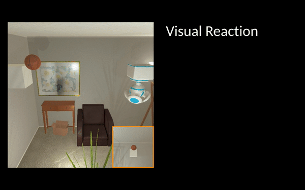
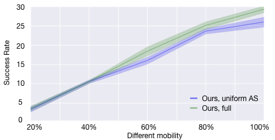
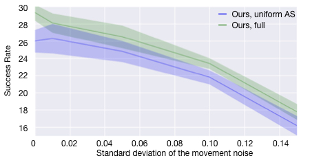

## [Visual Reaction: Learning to Play Catch with Your Drone](https://arxiv.org/pdf/1912.02155.pdf)

By Kuo-Hao Zeng, Roozbeh Mottaghi, Luca Weihs, and Ali Farhadi

[Paper](https://arxiv.org/pdf/1912.02155.pdf) | [Video](https://youtu.be/iyAoPuHxvYs) | [BibTex](#citing)



We address the problem of Visual Reaction, where the idea is to forecast the future and plan accordingly. We study the task in the context of catching objects with a drone. An object is thrown in the air, and the drone should plan to catch it. Each object has different physical properties and might collide with other objects and structures in the scene, making the task quite challenging. 

### Citing

If you find this project useful in your research, please consider citing:

```
@inproceedings{khz2020visualreaction,
  author = {Zeng, Kuo-Hao and Mottaghi, Roozbeh and Weihs, Luca and Farhadi, Ali},
  title = {Visual Reaction: Learning to Play Catch with Your Drone},
  booktitle = {CVPR},	    
  year = {2020}
}
```

### Set Up

0. Requirements

   We implement this codebase on Ubuntu 18.04.3 LTS and also have tried it on Ubuntu 16.

   In addition, this codebase needs to be executed on GPU(s).

1. Clone this repository

   ```
   git clone git@github.com:KuoHaoZeng/Visual_Reaction.git
   ```
   
2. Intsall `xorg` if the machine does not have it

   **Note**: This codebase should be executed on GPU. Thus, we need xserver for GPU redering.

   ```
   # Need sudo permission to install xserver
   sudo apt-get install xorg.
   ```

   Then, do the xserver refiguration for GPU

   ```
   sudo python startx.py
   ```

4. Using `python 3.6`, create a `venv`

   **Note**: The `python` version needs to be above `3.6`, since `python 2.x` may have issues with some required packages.
   
   ```
   # Create venv and execute it
   python -m venv venv && source venv/bin/activate
   ```
   
4. Install the requirements with

   ```
   # Make sure you execute this under (venv) environment
   pip install -r requirements.txt
   ```

### Environment/Dataset

We extend [AI2-THOR](http://ai2thor.allenai.org/) by adding a drone agent and a luncher to play
catch. After the luncher throws an object, the drone needs to
predict the trajectory of the object from ego-centric observations
and move to a position that can catch the object.

We collect a dataset consiting of 30 scenes (Living Rooms) in
AI2-THOR. The initial positions of the drone and the luncher are random.
The luncher randomly select an object from 20 objects list, and throws
it with random magnitudes in random directions. Overall, we collect 20K 
training trajectories, 5K validation trajectories, and 5K testing trajectories.

The [training data](data/train.json), [validation data](data/val.json), and [testing data](data/test.json) are available in the `data` folder.

For more information about how to control the drone agent in the environment, please vist this [Doc](https://ai2thor.allenai.org/ithor/documentation/).

#### Generate your own data

```
TBD
```

After the data generation, you need to change the `data_dir` to your data folder in the config file:

```
...
base_dir: "results/{{exp_prefix}}"
data_dir: "data" <-- change it to your data folder.
...
```

### Play Catch with Your Drone!

**Note**: You can always change or adjust the hyperparameters defined in the config file to change the setting such as how many GPUs are going to be used, how many threads are going to be used, how often you want to store a checkpoint, etc. You can also change the learning rate, number of iterations, batch size, etc. in the config file.

#### Test the pretrained model on validation/testing set

```
# Download the pretrained model
wget https://homes.cs.washington.edu/~khzeng/Visual_Reaction/pretrained.zip
unzip pretrained.zip && mv pretrained/* results/ && rm pretrained.zip

# Test the model
# The testing results would be stored by jsonlines file
# For the forecaster only
python main.py --config configs/pretrained_forecaster_test.yaml
# For the forecaster + action_sampler
python main.py --config configs/pretrained_action_sampler_test.yaml

# Evaluate the results
# For the forecaster only
python eval.py results/pretrained_forecaster test
# For the forecaster + action_sampler
python eval.py results/pretrained_action_sampler test
```

#### Train a new forecaster

```
# Train
python main.py --config configs/forecaster_train.yaml

# Validate or Test
python main.py --config configs/forecaster_val.yaml
python main.py --config configs/forecaster_test.yaml

# Eval
python eval.py results/forecaster val
python eval.py results/forecaster test
```

#### Train a new action sampler with a trained forecaster

```
# Prepare the trained forecaster
cd results
mkdir action_sampler
mkdir action_sampler/checkpoints
cp -r forecaster/checkpoints/$FORECASTER_YOU_LIKE_TO_USE action_sampler/checkpoints/0000000
cd ..

# Train
python main.py --config configs/action_sampler_train.yaml

# Validate or Test
python main.py --config configs/action_sampler_val.yaml
python main.py --config configs/action_sampler_test.yaml

# Eval
python eval.py results/action_sampler val
python eval.py results/action_sampler test
```

#### Main Results

| Model  | Success Rate |
| :-------------: | :-------------: |
| Forecastor w/ uniform AS (ours) | 26.0 &pm; 1.3 |
| Forecastor w/ action sampler (ours) | 29.3 &pm; 0.9 |
| CPP w/ KF | 23.2 &pm; 1.3 |
| CPP | 22.9 &pm; 2.3 |

#### Different Mobility



#### Noisy Movement

